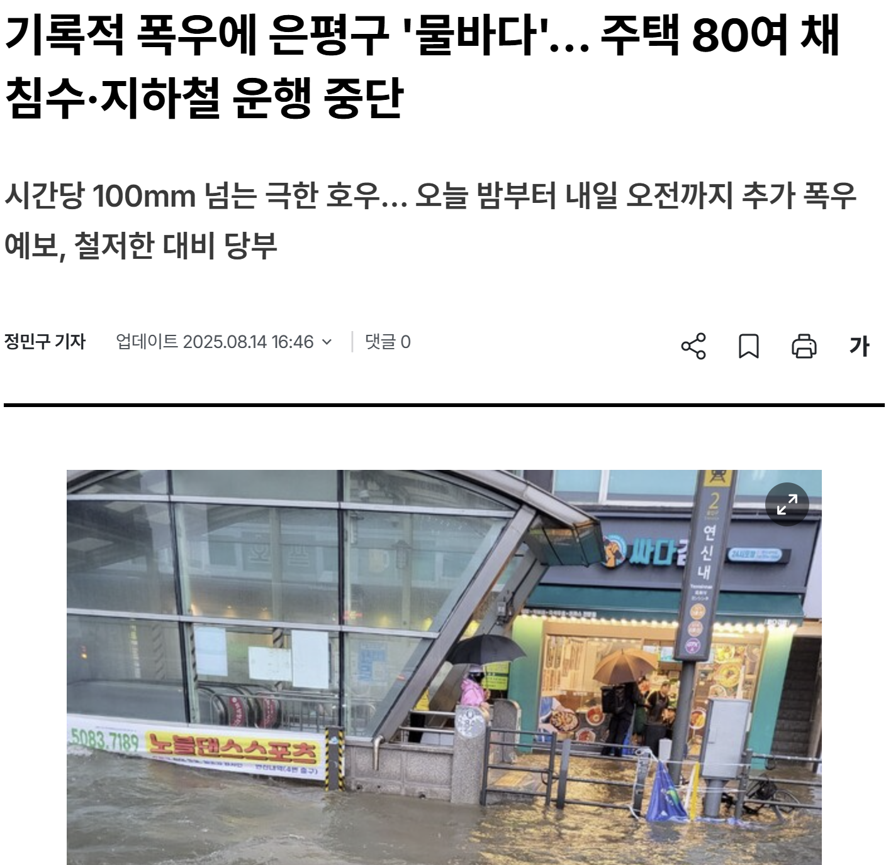
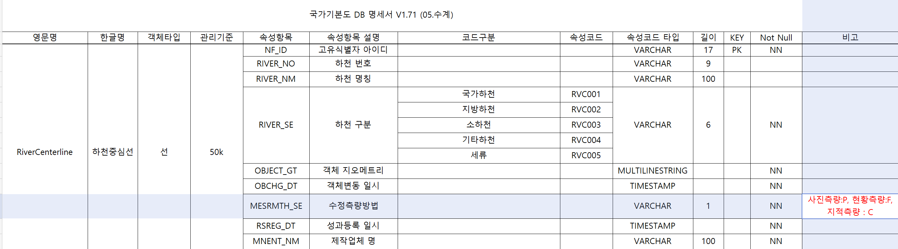
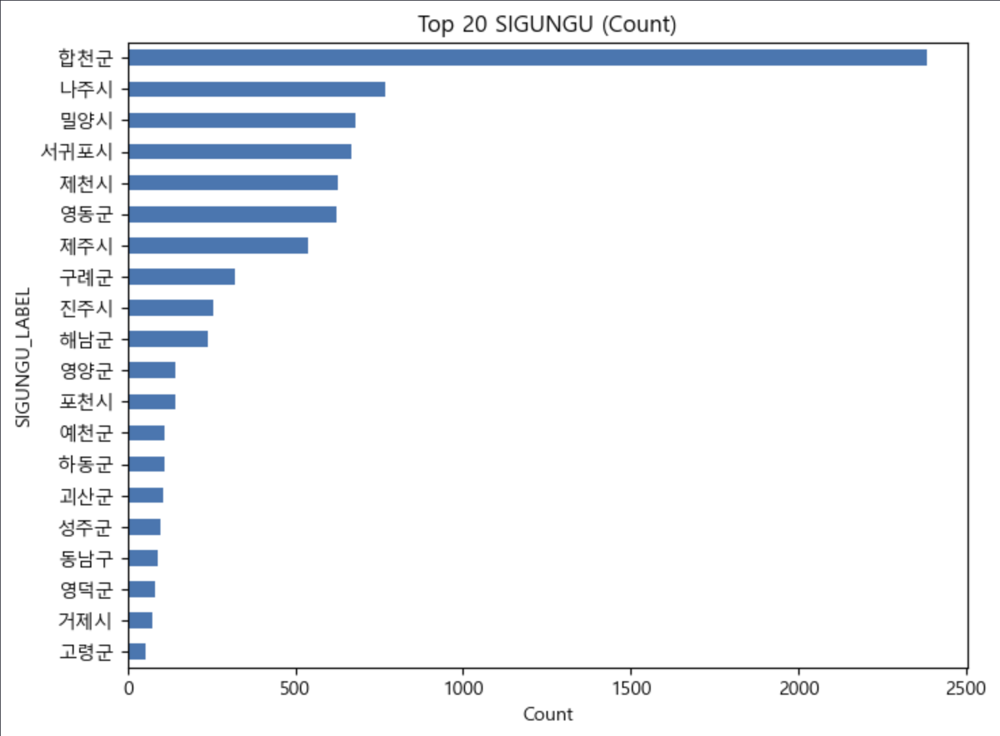
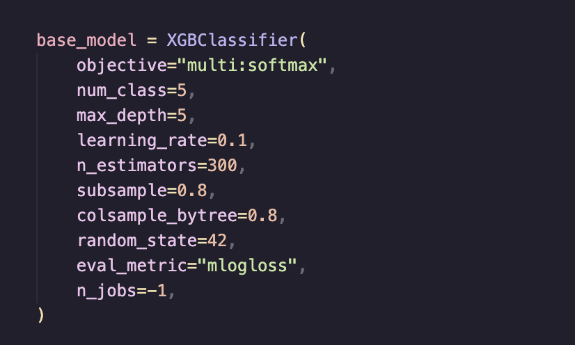
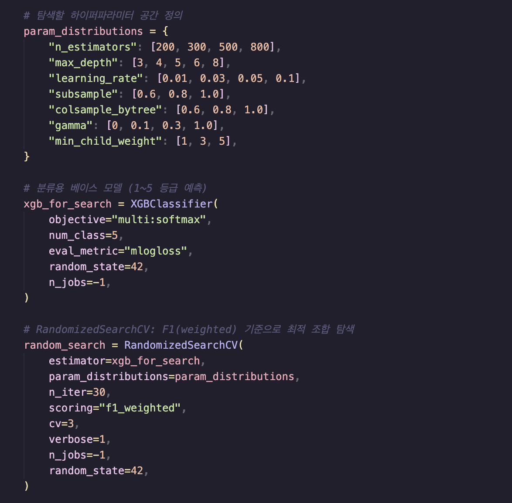
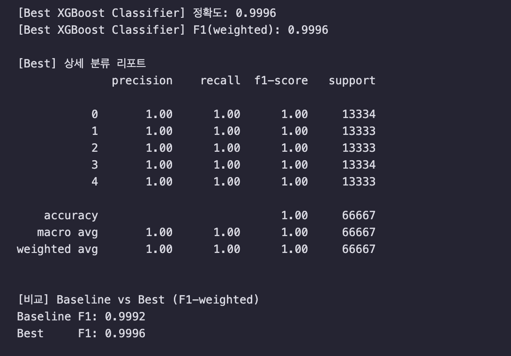

# Flooding Risk Prediction

# 🌧️ 침수 피해 예상 지역 예측 (Machine Learning)

## 강수·지형·하천·토지이용 등 생활환경 데이터를 활용한 침수 위험지역 예측

---

## 📅 프로젝트 기간
- 2026.02.04(요일) ~ 2026.02.11(요일)

---

# 1. 팀 소개

## 1-1. 팀
5TEAM - 햄스터

## 1-2. 팀원 구성 및 GitHub

| 이름 | 역할 | GitHub |
| --- | --- | --- |
| 김민준 | • Pandas 활용 데이터 전처리<br>• Matplotlib 활용 데이터 시각화 | https://github.com/miin-jun |
| 김유진 | • Pandas 활용 데이터 전처리<br>• Matplotlib, Seaborn 활용 데이터 시각화<br>• scikit-learn 활용 머신러닝 (KMeans) | https://github.com/shortcut-2 |
| 김지원 | • QGIS 통한 하천 거리 및 규모 등급 전처리<br>• 하천 데이터 CSV 전처리<br>• 머신러닝(모델: 미정) | https://github.com/edu-ai-jiwon |
| 박세현 | • 지역구 코드 전처리<br>• 지역구 면적 데이터 수집 | https://github.com/parksay |
| 임정희 | • 지역 코드 데이터 수집<br>• 침수 면적 데이터 크롤링<br>• 강수량 데이터 전처리<br>• 전처리 데이터 통합 및 가공<br>• 머신러닝 시각화 | https://github.com/bigmooon |


---

# 2. 프로젝트 개요

## 2-1. 프로젝트명
**침수 피해 예상 지역 예측**

## 2-2. 배경
본 프로젝트 아이디어는 “비는 매년 오는데, 왜 피해는 반복되는가?”라는 문제의식에서 출발하였다.

최근 몇 년간 한국 전역에서
**집중호우(국지성 폭우)**가 빈번해지면서, 도심 저지대·하천 인접 지역·배수 취약 지역을 중심으로 침수 피해가 반복되고 있다. 같은 도시 안에서도 어떤 구역은 잠기고, 어떤 구역은 비교적 안전한 모습을 보이는데, 이는 침수가 단순히 “비의 양”만으로 결정되지 않고 지형·토지이용·배수·하천과의 관계 같은 공간적 조건이 함께 작동한다는 점을 보여준다.


지형 요인: 저지대/경사도/유역 형태 등 물이 모이기 쉬운 구조

수문 요인: 하천과의 거리, 하천 범람 가능성, 주변 수계 밀도

도시·환경 요인: 불투수면(포장면) 비율, 배수 인프라 밀도, 토지이용(주거/상업/농경지)

기상 요인: 단시간 강우량, 누적 강우량, 강우 지속시간

즉, 침수는 “폭우가 오면 무조건 발생”하는 사건이라기보다, 물의 흐름이 특정 지점에 집중되는 구조와 도시의 취약성이 겹칠 때 피해로 이어진다.
이에 본 프로젝트는 반복되는 침수 피해를 단순 사례로 소비하는 수준에서 벗어나, 다양한 공간·환경 요인을 결합해 침수 피해가 발생할 가능성이 높은 지역을 사전에 예측하는 문제로 확장하고자 하였다.




## 2-3. 프로젝트 소개 및 목표
한국 전역을 대상으로 침수 관련 데이터를 결합하여 침수 위험(또는 침수 발생) 예측 모델을 구축한다.

예측 결과를 지도 기반으로 시각화하여 위험 지역을 직관적으로 제시한다.

학습 과정에서 중요하게 작용한 요인을 분석해, “어떤 조건이 침수 위험을 키우는가”에 대한 해석 가능성을 확보한다

---

# 3. 기술 스택

## 🛠 Tech Stack
| Category | Stack |
|----------|--------|
| **Language** |  |
| **Data Processing** |   |
| **ML** |  |
| **Visualization** |   |
---

## 4. 폴더 구조

```bash
ML_MINI_5TEAM/
├── data/
│   ├── raw/                # 크롤링/원본 데이터
│   ├── processed/          # 전처리/가공된 데이터
│   └── data.json           # 최종 통합 파일
│
├── src/                    # 소스 코드
│   └── features/           # 개인 작업 공간 분리
│       └── ljh/            # 본인 이니셜 폴더 (예: kmj, lyj ...)
│           ├── crawl_??.py
│           └── transform_??.py
│
├── docs/
│   └── git_strategy.md     # 협업 규칙/브랜치 전략 문서
├── main.py                 # 머신러닝 및 시각화 실행 파일
├── requirements.txt        # 의존성 관리
├── .gitignore
└── README.md
```

---

**# 5. 데이터 수집**
## 5-1. 하천 최소 거리 및 규모 데이터

침수는 강수량뿐 아니라 **하천 인접성(범람 위험)** 과도 관련이 있어, 하천 요인을 모델 입력 변수로 만들기 위해 아래 2종 공간 데이터를 수집했다.



### (1) 국가기본도 하천 중심선(RiverCenterline)
- 전국 하천 위치를 **선(Line/MultiLineString)** 형태로 제공
- 주요 컬럼: `NF_ID`, `RIVER_NO`, `RIVER_NM`, `RIVER_SE(하천구분)`

**하천 구분 코드(`RIVER_SE`)**

| 코드 | 의미 |
|---|---|
| RVC001 | 국가하천 |
| RVC002 | 지방하천 |
| RVC003 | 소하천 |
| RVC004 | 기타하천 |
| RVC005 | 세류 |

> 목적: **하천까지의 최소 거리** 및 **하천 규모 기반 등급** 파생변수 생성

### (2) 시군구 경계 데이터
- 전국 시·군·구 단위 **행정구역 경계(Polygon)** 데이터
- 목적: 하천 거리/등급을 **행정구역 단위로 집계**하기 위함

### (3) 활용 요약
- 시군구경계 ↔ 하천중심선을 결합해 **최소 거리(RIV_DIS_MIN)** 를 계산하고  
  거리 등급(`RIV_DIS_GRD`)과 규모 등급(`RIV_GRD`)을 생성하여 모델 입력 변수로 사용했다.


## 5-2. 침수 흔적도 데이터
- 과거 침수 발생 구역을 폴리곤 형태로 제공하는 공간 데이터(.shp)로, 모델 학습의 라벨/침수 이력 지표 생성에 활용. 
- 출처 : https://www.data.go.kr/data/15101791/openapi.do?recommendDataYn=Y&utm_source=chatgpt.com

## 5-3. 상습 침수 지역 데이터
- 반복 침수 위험지역 정보를 포함한 데이터로, 시군구 단위로 집계해 “상습 침수 여부/개수” 같은 입력 변수로 활용.
- 출처 : https://www.safetydata.go.kr/disaster-data/view?dataSn=52

## 5-4. 토양 배수 등급

- 토양 배수 등급: 침수 취약도 파악을 위해 전국의 토양 배수 등급 데이터 수집 (약 41만 건)
- .shp 파일로 수집, QGIS 프로그램을 통해 데이터 추출 → 가공
- 출처: 국토교통부 브이월드(https://www.vworld.kr/dtmk/dtmk_ntads_s002.do?svcCde=MK&dsId=30491)

## 5-5. 전국 배수 펌프장

- 전국 배수 펌프장 개수: 침수 피해 지역의 인프라 확인을 위해 배수 펌프장 데이터 수집 (555개)
    - 하수처리장은 흘러들어온 물을 ‘정화’하는 시설이기에 고려하였으나 수집하지 않음
- 출처: 공공데이터 포털(https://www.data.go.kr/data/15129436/standard.do)

## 5-6. 2016년 - 2025년 월별 강수량 / 기상관측소 정보

- 2016년 - 2025년 월별 강수량: 침수 피해 지역 예측을 위해 최근 10년 간의 지역별 / 월별 강수량 데이터 수집 (10,920개)
- 데이터 취합을 위해 기상관측소 정보와 매칭 → 정확한 지역 매칭
- 출처 : 기상청 API 허브(https://apihub.kma.go.kr/), 공공데이터 포털(https://www.data.go.kr/data/15043574/fileData.do)

---

# 6. 주요 지표 정의

## 6-1. 지표
#### 1) 하천까지의 최소 거리 (`RIV_DIS_MIN`)
- 각 시군구 영역 내에서 **하천 중심선까지의 최소 거리**를 계산한 값
- 가정: **하천 인접성이 높을수록(거리가 가까울수록)** 침수 위험이 증가할 가능성이 있음

#### 2) 하천 거리 기반 위험 등급 (`RIV_DIS_GRD`)
- `RIV_DIS_MIN`(최소 거리)을 기준으로 **거리 구간을 나눈 뒤**
- 침수 위험을 **5단계 등급(1~5)** 으로 재분류한 지표  
  - 예시: 1 = 안전, 5 = 위험  
  - (거리 구간 기준은 전처리 단계에서 정의)

#### 3) 하천 규모 기반 위험 등급 (`RIV_GRD`)
- 하천 규모(국가하천/지방하천/소하천 등) 기준으로 정의된 **등급 지표**
- 큰 규모의 하천일수록 범람 시 피해 가능성이 커질 수 있다는 가정을 반영하여 모델 입력 변수로 활용

## 6-2. 강수량 / 시설 지표

- `RAIN_TOTAL` : 해당 **연-월 / 지역** 기준 강수량 총량  
  - 목적: 특정 기간에 **강우 노출(비가 얼마나 왔는지)** 을 수치화하여 침수 위험과의 관계를 반영

- `PUMP_CNT` : 전국 **배수(빗물) 펌프장**의 지역별 개수  
  - 목적: 배수 인프라 수준(시설)을 간접적으로 반영  
  - 가정: 펌프장 수가 많을수록 배수 대응 능력이 높아 침수 위험이 완화될 가능성이 있음

---

## 6-3. 토양 배수 등급 지표

- `DRAINAGE_GRD` : 지역별 **토양 배수 등급**을 수치화한 지표
- 토양 배수 등급 분류 기준은 **국립농업과학원 ‘흙토람’** 자료를 참고하였다.  
  (출처: https://soil.rda.go.kr/soilmap/characteristic.do)

**원본 등급(6단계)**  
- 매우양호 → 양호 → 약간양호 → 약간불량 → 불량 → 매우불량

**모델 입력을 위한 수치 변환(1~6등급)**  
- 매우양호 = 1등급  
- 양호 = 2등급  
- 약간양호 = 3등급  
- 약간불량 = 4등급  
- 불량 = 5등급  
- 매우불량 = 6등급  

> 가정: 토양 배수 등급이 나쁠수록(숫자가 클수록) 물이 잘 빠지지 않아 침수 위험이 증가할 가능성이 있음


## 6-4. 침수 발생(이력) 지표

- 침수 기록 건수 (`FLOOD_CNT`)
  - 각 시군구(SIGUNGU) 단위로 침수(또는 침수 관련) 레코드 수를 집계한 값
  - 목적: 지역별 침수 이력의 “발생 빈도”를 정량화하여 분포/편중 여부를 확인
  - 해석: 값이 클수록 해당 지역에서 침수 관련 기록이 많이 관측됨  
    *(단, 실제 발생 빈도뿐 아니라 보고/집계 방식 차이의 영향도 있을 수 있음)*

- 침수 기록 순위 (`FLOOD_CNT_RANK`)
  - `FLOOD_CNT`를 기준으로 시군구를 내림차순 정렬해 부여한 순위
  - 목적: 침수 이력이 많은 상위 지역(핫스팟)을 빠르게 식별

---

## 7. 데이터 전처리 및 통합

### 7-1. 하천(RIV) 데이터 전처리

- **목표**: 시군구 단위로 하천 인접성/규모를 반영한 파생변수 생성  
  - `RIV_DIS_MIN` : 하천까지 최소 거리  
  - `RIV_DIS_GRD` : 거리 기반 위험 등급(1~5)  
  - `RIV_GRD` : 하천 규모 기반 등급

- **QGIS 처리**
  - 시군구 경계 포인트 ↔ 하천 중심선에 대해 “허브까지의 거리”로 **최소 거리(`RIV_DIS_MIN`)** 산출
  - 필드 계산기로 거리 등급(`RIV_DIS_GRD`) 생성

```sql
CASE
WHEN "RIV_DIS_MIN" > 1500 THEN 1
WHEN "RIV_DIS_MIN" > 700  THEN 2
WHEN "RIV_DIS_MIN" > 300  THEN 3
WHEN "RIV_DIS_MIN" > 100  THEN 4
ELSE 5
END 
```


### 7-2. 강수량/시설/토양 배수 등급 데이터 전처리

- **공통 처리**
  - 분석에 필요한 컬럼만 선택하여 사용(필요 컬럼 필터링)
  - 지역 매칭을 위해 시도/시군구 컬럼명 통일

- **강수량 데이터 (`RAIN_TOTAL`)**
  - 결측값(NaN)은 “해당 기간 강수 관측 없음(=0)”으로 보고 **0으로 대체**
  - 지역 ID 등 **핵심 키 결측**은 삭제 처리

- **배수 펌프장 데이터 (`PUMP_CNT`)**
  - 시도명/시군구명을 기준으로 그룹화 후 **지역별 펌프장 개수 집계**
  - 컬럼명 표준화: `SIDO_N`, `SIGUNGU_N`, `PUMP_CNT`

### 7-3. 데이터 통합(merge)

- 시군구 단위 예측을 위해 모든 데이터를 **SIGUNGU(시군구 코드/명)** 기준으로 결합
- 각 데이터셋에서 컬럼명을 통일한 뒤 **순차적으로 merge**하여 최종 학습 데이터셋을 구성

---

# 8. 시각화

### 8-1. 침수 관련 기록 상위 지역 (Top 20 SIGUNGU - Count)



#### 시각화 목적
- 침수(또는 침수 관련) 데이터가 **어떤 시군구에 많이 집중**되어 있는지 확인
- 데이터 분포의 편중 여부를 점검하고, 후속 분석(심각도/강수량) 필요성을 판단

#### 해석 및 인사이트
- 상위권 지역은 다음 가능성을 동시에 가짐
  1) 실제로 침수(피해/위험 노출)가 잦았을 가능성  
  2) 관측/보고/집계 방식 차이로 특정 지역의 기록이 더 많이 남았을 가능성(데이터 편향)
- 따라서 단순히 “건수가 많다 = 위험하다”로 결론 내리기보다,
  **심각도(평균 침수등급)와 강우 노출(누적 강수량)** 을 함께 확인하여 해석을 보완하는 전략이 필요함

---

## 9. 머신러닝

### 9-1. XGBoost Classification

#### 1) 모델 선택 근거
- **Feature Importance**를 제공하여 침수 취약도에 영향을 미치는 요인을 정량적으로 해석 가능
- 비선형 관계 및 변수 간 **복잡한 상호작용**을 효과적으로 학습
- 규제(regularization) 및 트리 기반 부스팅 특성으로 **과적합 완화** 및 성능 향상 기대


#### 2) Base Model 학습 결과
- **Train Accuracy**: 1.0000 (100.00%)
- **Test Accuracy**: 0.9992 (99.92%)
- **Weighted F1-Score**: 0.9992

기본 모델에서도 Test Set에서 높은 성능을 보였으나, **Train Accuracy가 100%**로 나타나 과적합 가능성이 존재한다고 판단하였다.  
이에 따라 하이퍼파라미터 최적화를 통해 **일반화 성능 개선**을 시도하였다.


#### 3) 하이퍼파라미터 최적화
- **탐색 방법**: `RandomizedSearchCV`
- **교차 검증**: 3-Fold *Stratified* Cross-Validation
- **평가 지표**: Weighted F1-Score
- **탐색 반복**: 100회 랜덤 샘플링




최적화 결과, **Weighted F1-Score가 0.9996**까지 향상되었다.

### 9-1-2. RandomForest

#### 1) 모델 선택 근거
- 다수의 결정트리를 앙상블로 결합하는 방식으로 비선형 관계 및 변수 간 상호작용을 학습 가능
- class_weight="balanced" 설정을 통해 클래스 불균형(침수 발생/미발생 비율 차이) 상황에서도 학습 편향을 줄이도록 설계


#### 2) Base Model 학습 및 평가
- **Train/Test Split**
- test_size=0.2, random_state=42

  
- 클래스 비율 유지를 위해 stratify=y 적용
- **RandomForest 설정**
- n_estimators=300
- class_weight="balanced"

#### 3) 결과 해석 포인트
- stratify=y와 class_weight="balanced"를 통해 침수 발생 여부(0/1) 불균형 문제를 완화하면서 학습을 진행
- FLOOD_AREA, FLOOD_GRD, DEAD 등은 피해 결과를 직접 반영할 수 있는 변수로 판단

### 9-1-3. 군집 분석 (KMeans)

- 군집의 장점인 간단한 개념과 구현, 대용량 데이터에서도 활용 가능한 점을 토대로 KMeans 모델을 활용


- 첫 시도이므로 초기 중심점 설정 및 중심점 설정/최대반복횟수를 설정
- features는 연월/지역코드를 제외한 모든 칼럼을 넣음 → 칼럼 간의 경향성과 이상치 확인을 위함


- FLOOD_AREA 스케일 조정의 필요성 확인
- 1번 군집의 경우, 강수량이 많고 침수 피해를 입은 당일의 강수량이 다른 군집에 비해 높은 편
    → 하천과의 최소 거리 또한 멀지 않아, 침수 피해가 기존에도 많았던 집단의 경향성을 확인
- 2번 군집의 경우, 1번 군집의 버금 갈 정도로 침수 피해 지역의 범위가 넓으나, 하천과의 거리가 멀고 배수펌프장의 개수가 다수 분포
    → 타 군집보다 다소 도시화된 지역으로 추정


- 중심점 개수를 늘리고, 편차가 컸던 FLOOD_AREA의 상위 값 2%를 제외하고 다시 확인


- 중심점을 과도하게 늘린 것 같다고 생각됨 → 5번 군집에서 강수량은 0 / 침수 피해 당일 188mm에 사상자 51명 수치에 의문점이 듦
    - 5번 군집의 데이터를 찾아보니, 2020년 7월의 부산시 수영구 ⇒ 해당 연월에 부산시 전역 침수 피해 발생
    - 출처: 연합뉴스 (https://www.yna.co.kr/view/AKR20200723194051051)
    
    
    
- 단, 해당 군집의 데이터가 부산시 수영구 하나뿐으로, RAIN_TOTAL 데이터가 제대로 수집/처리되지 않은듯함 ⇒ 노이즈로 판단되어 이상치로 제거


- 중심점의 개수를 4개로 다시 줄이고, 총 강수량 대신 피해 당일의 강우량을 선택 → 부산시 수영구의 데이터를 제거한 결과, 이전보다는 나아짐


- 실루엣 계수는 0.7203로, 군집화의 성능은 나쁘지 않다고 판단함 (이상치 제거가 원인으로 보임)


# 10. 한 줄 회고

- 김민준: 사실 이번 2차 미니프로젝트에 대해서 크게 기여를 했다고 보기 어려울것 같다. api가 주말동안 승인이 안 나서 데이터 전처리하는데 크게 도움을 주지 못 했고, 심지어 이번이 머신러닝과 관련된 프로젝트인데 머신러닝을 해보지 못 했다는게 이게 너무 속상했다. 데이터 전처리에 시간을 너무 소비한 나머지 머신러닝까지 못 했다는 것이 너무 아쉬웠다

- 김유진: 지난 mini 프로젝트의 아쉬웠던 점인 공식적 지표를 활용하고, 주제 선정이 오래 걸렸지만 팀원들과 협의해 의미 있는 주제를 선정한 것이 좋았다. 그러나 정제된 데이터라도 분석을 위해 타 데이터와 결합하는 과정에서 결측치가 발생하는 점을 파악하지 못했던 패착이 있었다. 팀원들과 함께 최종 데이터 전처리에 힘썼으나, 만족할 만한 결과는 나오지 못한 듯해 아쉽다. 금번 프로젝트에서 느낀 아쉬움을 보완하고자 다음 프로젝트에서는 데이터 간의 연관성을 좀 더 꼼꼼하게 파악하는 등 노력할 예정이다.

- 김지원: 공간 데이터 분석 과정 중 하천 중심선과 시군구 경계 데이터를 어떻게 활용해야 할지 고민했었다. 위치 정보와 행정 단위를 연결하는 과정이 처음에 명확히 이해되지 않았으나 QGIS를 통해 거리 계산하니 조금 더 쉽게 눈에 담을 수 있었다. 하천까지의 최소 거리가 개별 좌표 값에서 시군구 단위의 지표로 변환되는 과정을 거치며 공간 데이터는 단독으로 의미를 가지기 어렵다는 것을 체감했다. 

- 박세현:  온라인에 많은 데이터가 흩어져 있더라도 기준이나 형태가 제각각이라 함께 통합해서 쓴다는 게 어렵다는 걸 느꼈고 머신러닝은 데이터 싸움이라는 말이 공감이 갔다

- 임정희: 결측치 등을 납득할 수 있는 형태로 만드는 것이 가장 어려웠습니다. 학습 및 예측에 따라서 팀원들이 인정할만한 데이터 전처리를 할 수 있도록 연습하는 시간이 된 것 같습니다.

---

# 11. 한계점 및 제언

- 데이터를 수집할 때 지역구 단위로 뭉뚱그려서 통계 내거나 단위가 달라서 위험도 분석이 정밀하지 못할 수 있음.
- 하천이나 배수 펌프장 등의 양적인 데이터만 수집 가능했고, 질적인 데이터가 반영되지 않음. 배수 용량이나 노후도, 도시 인프라 등에 따라 영향이 다를 수 있음.
- 수집한 데이터 외에 강풍이나 기상 이변 등에 의한 위험도는 예측에 반영되지 못함.
- 현재 프로젝트는 과거 데이터만을 활용하고 있음. 현재 하천 높이를 활용할 수 있는 API 나 날씨 데이터를 반영하여 위험도를 실시간으로 예측하거나 경고할 수 있다면 더 활용도가 높을 것

---

# 12. 출처

- 국가기본도_하천중심선: 국토교통부의 ‘V-WORLD’
- 시군구경계: 국토교통부의 ‘V-WORLD’
- 지역구별 면적: 국토교통부 통계누리
